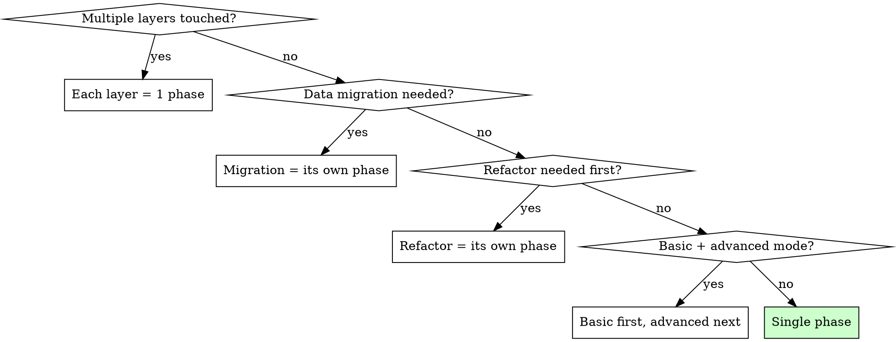

# Feature Planning

## Overview

Plan a feature within an existing codebase: generate an Impact Map, define a mini-Roadmap of short phases, and detail phase 1 with spec + tasks. This is the lighter version of phase-planning — designed for features in codebases where the architecture, stack, and conventions already exist.

**Core principle:** In existing codebases, the biggest risk is breaking what already works. The Impact Map prevents this by making the blast radius of your changes explicit before you write a single line of code.

**Announce at start:** "I'm using the pbs-feature-planning skill to plan the feature [name] in this existing codebase."

## When to Use

- Planning a feature in an existing codebase after familiarization (context map approved)
- Planning a feature after lightweight exploration produced a Feature Brief
- Re-planning a feature because the human found issues in the initial Impact Map or phase plan

## The Iron Law

```
NO IMPLEMENTATION UNTIL HUMAN APPROVES IMPACT MAP + PHASE PLAN.
```

Planning and coding happen in separate sessions. This skill produces documents only.

## The Process

### Step 1: Load Context

Read these documents:

1. **Codebase Context Map** — `.pbs-framework/features/[feature-name]/codebase-context-map.md`
   - Pay attention to: relevant files, reference module, existing tests, patterns to follow
2. **Feature Brief** (if it exists) — `.pbs-framework/features/[feature-name]/feature-brief.md`
   - If no Feature Brief, read the feature request/ticket directly
3. **AGENTS.md** (if it exists) — project conventions and constraints

### Step 2: Generate Impact Map

Generate `.pbs-framework/features/[feature-name]/impact-map.md`:

```markdown
# Impact Map

## Feature: [name]
## Date: [date]

---

## 1. Direct Changes
(Files the feature intentionally modifies or creates)

| File | Change type | Description |
|------|------------|-------------|
| | create / modify / delete | |

## 2. Indirect Impact
(Files/modules not directly modified but potentially affected)

| File/Module | How it's affected | Action needed |
|-------------|-------------------|---------------|
| | | verify / update test / no action |

## 3. Change Dependencies
### Upstream (what consumes what you're changing)
- [consumer 1]: [how it's affected]

### Downstream (what your changes depend on)
- [dependency 1]: [what needs to be stable]

## 4. Migrations and Data
### Schema changes
| Table/Collection | Change | Reversible migration? |
|-----------------|--------|----------------------|
|                 |        |                      |

### Impact on existing data
[What happens with data already in production]

## 5. Tests Affected
### Tests that might break
| Test file | Why | Action |
|-----------|-----|--------|
|           |     | update / delete |

### New tests needed
| What to test | Type | Priority |
|-------------|------|-----------|
|             | unit/integration/e2e | |

## 6. Impact Checklist
- [ ] Reviewed all consumers of the code I'm modifying
- [ ] Verified migrations are reversible
- [ ] Identified all tests that need updating
- [ ] Confirmed no in-progress PRs touching the same files
- [ ] Checked for feature flags affecting this area
```

### Step 3: Generate mini-Roadmap

Divide the feature into 1-4 short phases. Each phase should be hours to 1 day — not days to weeks.

**Phase division rules:**



**Each phase MUST be independently deployable/mergeable.** If phase 2 requires phase 3 to be ready for anything to work, the division is wrong.

Add the roadmap to the Impact Map file or generate a separate `.pbs-framework/features/[feature-name]/roadmap.md`.

### Step 4: Detail Phase 1

Generate `.pbs-framework/features/[feature-name]/phases/phase-01/spec.md`:

```markdown
# Phase Spec — Fase 1: [Name]

## Objective
[What this phase achieves — 1 sentence]

## Changes to implement
(Reference to Impact Map)
| File | What to do |
|------|-----------|
|      |           |

## Expected Behavior
### New/modified flow
1. [step 1]
2. [step 2]
→ [result]

### Acceptance Criteria
- Given [precondition], When [action], Then [result]
- ...

### Edge cases
- [case]: [expected behavior]

## Reference Code
(Existing module/file to follow as pattern)
- [file]: [what pattern to copy from here]

## What this phase does NOT touch
- [file/area out of scope]

## Verification
- [ ] New tests pass
- [ ] Existing tests still pass
- [ ] [feature-specific verification]
```

Generate `.pbs-framework/features/[feature-name]/phases/phase-01/tasks.md`:

Same format as phase-planning tasks, but each task MUST include:
- **Pattern module** — existing code to follow as template
- **Existing tests check** — validation command to verify existing tests don't break

```markdown
# Tasks — Phase 1

## Execution Order
1. T-01: [name] — no dependencies
2. T-02: [name] — depends on T-01

## Tasks

### T-01: [Descriptive name]
- **Objective:** [what this task produces]
- **Pattern module:** [existing file to follow as template]
- **Context files:** [files the agent must READ]
  - [file 1] — [why it's relevant]
- **Files to create/modify:**
  - [file] — [what to do with it]
- **Acceptance Criteria:**
  - [ ] [verifiable criterion 1]
  - [ ] [verifiable criterion 2]
- **Validation Commands:**
  - `[command]` — [what it validates]
  - `[existing test command]` — verify existing tests still pass
- **Status:** pending
```

### Step 5: Self-Review

Before presenting to the human, verify:

- [ ] Impact Map covers direct changes, indirect impact, and dependencies
- [ ] All consumers of modified code are identified
- [ ] Tests that might break are listed
- [ ] Phases are independently deployable
- [ ] Phase 1 spec has Given/When/Then acceptance criteria
- [ ] Every task references a pattern module
- [ ] Every task has a validation command for existing tests
- [ ] No task touches 4+ output files
- [ ] The spec's out-of-scope section is explicit

### Step 6: Present to Human

Present a summary:
- Impact Map highlights: total files affected (direct + indirect), migration needed (yes/no), tests at risk
- Number of phases and estimated duration each
- Number of tasks in phase 1
- Any risks or ambiguities to resolve before starting

<HARD-GATE>
Do NOT proceed to implementation. Do NOT start any task.
The human MUST review and approve the Impact Map AND the phase plan first.
If the human requests changes, regenerate the affected sections.
This applies regardless of how simple the feature appears.
</HARD-GATE>

## Common Mistakes

- **No Impact Map for "simple" features** — simple features in complex codebases cause the most unexpected breakage. Always map impact.
- **Missing upstream consumers** — you checked what you depend on, but not what depends on you. Both directions matter.
- **Tasks without a pattern module reference** — in existing codebases, every task should follow an existing pattern. Find it.
- **Not verifying existing tests as a validation command** — "existing tests still pass" is mandatory for every task in existing codebase work.

## Red Flags

- "The feature is small, I don't need an Impact Map" → Small features in large codebases cause the most unexpected breakage. Always map impact.
- "I already know what to change" → Map it anyway. The indirect impact is what you miss.
- "Existing tests are fine, I don't need to check" → List them. Verify them. "Fine" is not evidence.
- "Let me start coding phase 1 while the human reviews" → Iron Law. Wait for approval.
- "One phase is enough" → Maybe. But verify against the division rules first.
- "I'll follow my own pattern instead of the codebase's" → Always follow existing patterns. Consistency over preference.

## Common Rationalizations

| Excuse | Reality |
|--------|---------|
| "The Impact Map is obvious for this feature" | Obvious impact maps take 10 minutes. Hidden breakage takes hours to debug. |
| "This doesn't need phases, it's one change" | If it touches multiple layers or needs migration, it needs phases. |
| "Existing tests will just pass" | Run them. "Will pass" is a prediction, not evidence. |
| "The reference module pattern doesn't fit my case" | There's always a closer match. Look harder. If truly nothing fits, document why. |
| "I can figure out the impact as I go" | That's how you break consumers you didn't know existed. |
| "Migration can be part of the main phase" | Migrations are independently deployable and testable. Separate them. |

## Integration

**Called after:**
- pbs-codebase-familiarization — context map ready and approved
- pbs-exploration-brainstorming (lightweight mode) — if Feature Brief was generated

**Calls next:**
- pbs-task-execution — for each task, AFTER human approves the plan

**Uses same execution skills as pbs-phase-planning:**
- pbs-task-execution — to implement each task
- pbs-phase-validation — to validate each phase against spec
- pbs-phase-closure — to close each phase with a lightweight closure report

**Required skills for tasks:**
- **REQUIRED:** superpowers:test-driven-development — all tasks follow TDD
- **REQUIRED:** superpowers:verification-before-completion — verify existing tests don't break

**Mandatory validation criterion for every phase:**
- "Existing tests still pass" — this is non-negotiable for existing codebase work

**Language:** Write all `.pbs-framework/` documents in the language defined in AGENTS.md `framework_language` field.
