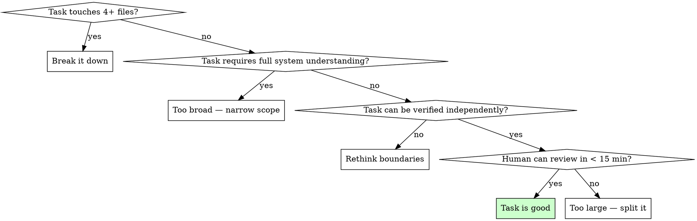

# Phase Planning

## Overview

Generate the Phase Spec (spec.md) and Tasks (tasks.md) for a construction phase. This is the "PENSAR" step — define what to build and in what order before touching any code.

**Core principle:** A detailed plan IS a prompt. The better the plan, the better the generated code. Invest time here to save time during implementation.

**Announce at start:** "I'm using the pbs-phase-planning skill to plan phase [N]."

## When to Use

- Starting a new construction phase after definitions are ready (phase 1)
- Starting a new construction phase after reviewing the previous closure report (phase 2+)
- Re-planning a phase because the human found issues in the initial plan

## The Iron Law

```
NO IMPLEMENTATION UNTIL HUMAN APPROVES BOTH SPEC AND TASKS.
```

Planning and coding happen in separate sessions. This skill produces documents only.

## Input

**Global context (always required):**
- `.pbs-framework/00-project-brief.md` — scope and constraints
- `.pbs-framework/01-system-overview.md` — entities, capabilities, integrations
- `.pbs-framework/02-technical-design.md` — stack, modules, data flow
- `.pbs-framework/03-decision-log.md` — decisions already taken
- `.pbs-framework/04-roadmap.md` — which phase to plan

**Phase context (if NOT first phase):**
- Previous closure report: `.pbs-framework/phases/phase-{N-1}/closure-report.md`
- Architecture snapshot: `.pbs-framework/06-architecture-snapshot.md` (if exists)

## The Process

### Step 1: Load Global Context

Read ALL of these documents to understand the project:

1. `.pbs-framework/00-project-brief.md` — scope and constraints
2. `.pbs-framework/01-system-overview.md` — entities, capabilities, integrations
3. `.pbs-framework/02-technical-design.md` — stack, modules, data flow
4. `.pbs-framework/03-decision-log.md` — decisions already taken (DO NOT contradict these)
5. `.pbs-framework/04-roadmap.md` — which phase to plan, what it should deliver

### Step 2: Load Phase Context

If this is NOT the first phase:
1. Read the previous closure report: `.pbs-framework/phases/phase-{N-1}/closure-report.md`
   - Pay special attention to "Observaciones para la Siguiente Fase"
   - Note the "Relevant Assets for Next Phase"
   - Check for the suggested surgical question for re-analysis
2. Read the architecture snapshot: `.pbs-framework/06-architecture-snapshot.md` (if it exists)

### Step 3: Generate spec.md

Generate `.pbs-framework/phases/phase-XX/spec.md` following this template:

```markdown
# Phase Spec — Fase [N]: [Name]

## Objetivo
[1-2 sentences: what this phase achieves]

## Capacidades que implementa
(Reference to 01-system-overview.md)
- CAP-X: [name]
- CAP-Y: [name]

## Comportamiento Esperado

### CAP-X: [name]
**Flujo principal:**
1. [step 1]
2. [step 2]
3. [result]

**Acceptance Criteria:**
- Given [precondition], When [action], Then [result]
- Given [another case], When [action], Then [result]

**Edge cases conocidos:**
- [edge case]: [expected behavior]

**Error cases:**
- [error]: [expected behavior]

### CAP-Y: [name]
...

## Contratos relevantes para esta fase
(ONLY contracts this phase needs — not all system contracts)

### [Module A] → [Module B]
- Input: [type/structure]
- Output: [type/structure]
- Error: [what happens on failure]

## Restricciones de la fase
- [rules the agent must respect]
- [project patterns that apply]

## Estrategia de Testing
- Unit tests: [what to cover]
- Integration tests: [what flows to validate]
- Contract tests: [what interfaces to verify]

## Lo que esta fase NO toca
(Explicit so the agent doesn't drift)
- [out-of-scope area 1]
- [out-of-scope area 2]
```

**Rules for spec generation:**
- Acceptance criteria MUST be in Given/When/Then format
- Edge cases and error cases ONLY for this phase's capabilities — never for future phases
- Contracts ONLY for modules that interact in this phase
- "Lo que esta fase NO toca" must be explicit — this prevents scope creep during implementation

### Step 4: Generate tasks.md

Generate `.pbs-framework/phases/phase-XX/tasks.md` following this template:

```markdown
# Tareas — Fase [N]

## Orden de Ejecucion
[Ordered list of tasks with explicit dependencies]
1. T-01: [name] — no dependencies
2. T-02: [name] — depends on T-01
3. T-03: [name] — depends on T-01
4. T-04: [name] — depends on T-02 and T-03

## Tareas

### T-01: [Descriptive name]
- **Objetivo:** [what this task produces]
- **Archivos de contexto:** [files the agent must READ]
  - [file 1] — [why it's relevant]
  - [file 2] — [why it's relevant]
- **Archivos a crear/modificar:**
  - [file] — [what to do with it]
- **Acceptance Criteria:**
  - [ ] [verifiable criterion 1]
  - [ ] [verifiable criterion 2]
- **Validation Commands:**
  - `[command 1]` — [what it validates]
  - `[command 2]` — [what it validates]
- **Estado:** pendiente

### T-02: [Name]
...
```

**Rules for task generation:**
- Each task MUST be completable in a single AI session
- Each task MUST touch at most 2-3 output files
- Each task MUST include validation commands
- Each task MUST list its context files explicitly — these are the ONLY files the agent will read
- Each task MUST have acceptance criteria — no exceptions
- Tasks follow TDD: reference superpowers:test-driven-development
- Order MUST respect dependencies — a task never depends on something that comes after it

### Step 5: Self-Review

Before presenting to the human, verify:

- [ ] Every acceptance criterion from the spec maps to at least one task
- [ ] Tasks are ordered respecting dependencies
- [ ] No task touches 4+ output files
- [ ] Every task has validation commands
- [ ] Every task has acceptance criteria
- [ ] No task requires understanding the whole system — only its listed context files
- [ ] The spec's "Lo que esta fase NO toca" is consistent with the task boundaries
- [ ] Contracts are defined ONLY for this phase's module interactions

### Step 6: Present to Human

Present a summary:
- Number of tasks generated
- Estimated complexity (simple/medium/complex per task)
- Any risks or ambiguities the human should resolve before starting
- Any decisions that need to be made (suggest adding to Decision Log)

<HARD-GATE>
Do NOT proceed to implementation. Do NOT start any task.
The human MUST review and approve BOTH spec.md and tasks.md first.
If the human requests changes, regenerate the affected sections.
This applies regardless of how confident you are in the plan.
</HARD-GATE>

## Granularity Rules



## Common Mistakes

- **Tasks with no validation commands** — if it can't be validated, it can't be verified. Every task needs at least one command.
- **Acceptance criteria without Given/When/Then** — vague criteria lead to vague implementations. Use the format.
- **One giant task instead of several small ones** — if it touches 4+ files, it's too big. Break it down.
- **Context files not listed per task** — the implementing agent reads ONLY what's listed. Missing a file = broken implementation.

## Red Flags

Signs the agent is about to violate the process — STOP if you catch yourself thinking:

- "Let me start coding while planning" → NO. Plan first, implement later (separate session).
- "This task is too small for acceptance criteria" → Every task needs criteria. No exceptions.
- "I'll figure out the order later" → Dependencies must be explicit NOW.
- "Let me define edge cases for the next phase too" → Only THIS phase. Future phases get planned later.
- "The human will understand what I mean" → Be explicit. Ambiguity causes bad implementations.
- "This task is obvious, no need for context files" → List them. The implementing agent reads ONLY what's listed.
- "I'll skip validation commands for simple tasks" → Every task needs validation. Simple tasks have simple validations.

## Common Rationalizations

| Excuse | Reality |
|--------|---------|
| "One big task is simpler than three small ones" | Small tasks are reviewable. Big tasks hide issues. |
| "The acceptance criteria are implicit in the task name" | Implicit criteria get ignored. Write them out. |
| "Validation commands depend on the implementation" | Define what to validate, not how. The implementing agent picks the commands. |
| "Context files are obvious" | Nothing is obvious to a fresh session. List everything. |
| "This phase is simple, spec is overkill" | Simple phases have simple specs. The structure still matters. |
| "Let me implement task 1 while planning the rest" | Iron Law: no implementation until human approves the full plan. |
| "Edge cases for future phases save time later" | Future phases get re-planned. Your predictions will be wrong. |

## Integration

**Called after:**
- pbs-generating-definitions — for phase 1
- pbs-phase-closure — for subsequent phases (human reviews closure, then triggers planning)

**Calls next:**
- pbs-task-execution — for each task, AFTER human approves the plan

**References:**
- superpowers:test-driven-development — tasks should be structured for TDD execution
- superpowers:verification-before-completion — validation commands in each task

**Language:** Write all `.pbs-framework/` documents in the language defined in AGENTS.md `framework_language` field.
