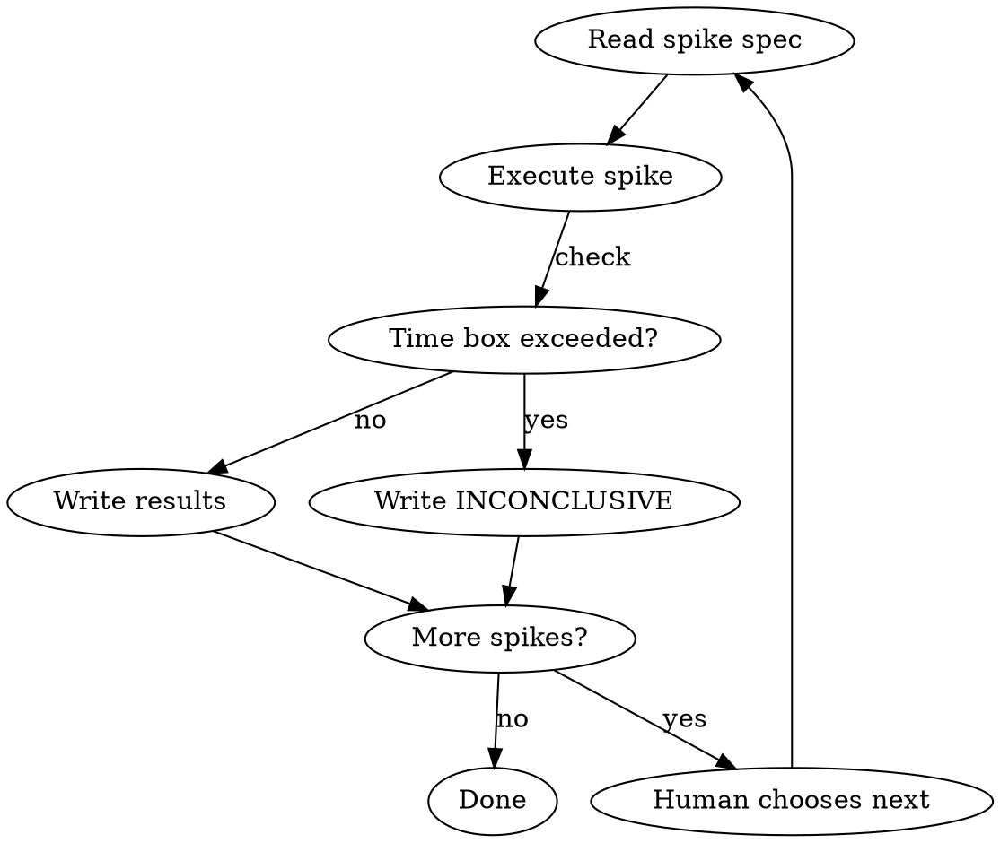

# Spike Execution

## Overview

Execute one or more spike specs generated by pbs-exploration-discovery in a **dedicated session**. Each spike answers ONE specific technical question with evidence. Results are written directly into the spike spec file so the discovery session can read them.

**Core principle:** A spike is a mini-experiment, not a prototype. It answers a question with evidence and gets discarded. The code is throwaway — only the findings matter.

**Announce at start:** "I'm using the pbs-spike-execution skill to execute spike: [spike name]."

## When to Use

- Discovery generated spike specs at `.pbs-framework/exploration/spikes/`
- You're in a fresh session dedicated to spike execution (not the discovery session)
- A technical question needs a real experiment to answer (not just docs or web search)

## The Iron Law

```
ANSWER THE QUESTION. ONLY THE QUESTION.
THIS IS NOT A PROTOTYPE. THE CODE IS THROWAWAY.
EVIDENCE BEFORE OPINIONS.
```

## Input

Read the spike spec file: `.pbs-framework/exploration/spikes/spike-XX-[name].md`

The spec contains:
- **Question:** the exact thing to answer
- **Success criteria:** what "viable" looks like
- **Max time:** time box (do NOT exceed)
- **Context references:** links to brainstorming/discovery context
- **Approach:** suggested steps

## The Process

### Step 1: Understand the Question

1. Read the spike spec file
2. Read any context references listed in the spec
3. Confirm you understand what "success" and "failure" look like
4. If the question is ambiguous, write your interpretation in the Results section and ask the human before proceeding

### Step 2: Execute the Spike

Choose the approach that best answers the question:

**Option A: Code spike** (most common)
1. Create a minimal, isolated script or test that answers the question
2. **OPTIONAL:** Use superpowers:test-driven-development — write the expected outcome as a test first
3. Run it and capture real output
4. Working directory: create spike code in a temporary location or in `.pbs-framework/exploration/spikes/code/` — this code is throwaway

**Option B: Integration spike**
1. Set up the minimum integration (API call, library usage, connection)
2. Test with real data, not mocks
3. Capture: latency, response format, error cases, rate limits
4. Save raw responses as evidence

**Option C: Research spike** (when code isn't needed)
1. Read official docs, changelogs, GitHub issues
2. **REQUIRED:** Use superpowers:verification-before-completion — verify claims with primary sources
3. Document findings with links to sources

If the spike fails or hits unexpected issues:
- **REQUIRED BACKGROUND:** Use superpowers:systematic-debugging — understand WHY it failed
- "Doesn't work" is not a valid finding. WHY doesn't it work?

### Step 3: Time Box Check

```
If approaching max time and no clear answer:
  → Document what you tried, what you learned, what remains unknown
  → Mark result as "INCONCLUSIVE" with partial findings
  → Do NOT extend beyond the time box without human approval
```

### Step 4: Write Results

Write the results **directly into the spike spec file**, filling in the `## Results` section:

```markdown
## Results

**Status:** VIABLE / NOT VIABLE / INCONCLUSIVE / VIABLE WITH CAVEATS
**Time spent:** [actual time]
**Executed by:** [session ID or date]

### Findings
[What you discovered — be specific, include numbers, formats, error messages]

### Evidence
[Actual output, response samples, screenshots, test results — NOT summaries]

### Conclusion
[Direct answer to the original question in 1-3 sentences]

### Impact on Discovery
[How this result affects technical decisions — what should change in the discovery synthesis]

### Spike Code Location
[Path to throwaway code, or "inline above" if small enough]
```

<HARD-GATE>
Do NOT modify any files outside the spike spec and the spike code directory.
Do NOT make architectural decisions — report findings, let discovery decide.
Do NOT continue to other spikes without human reviewing the results first.
</HARD-GATE>

## Multiple Spikes in One Session

If multiple spike specs exist:
1. List all pending spikes to the human
2. Human chooses which to execute (may be all, may be a subset)
3. Execute ONE spike at a time — complete results before starting next
4. Each spike gets its own results section in its own spec file



## Common Mistakes

- **Building a prototype instead of answering the question** — a spike is 20-50 lines of throwaway code, not a mini-app. If you're creating files and modules, you've gone too far.
- **Exceeding the time box** — if 2 hours haven't answered the question, the answer might be "this is harder than expected" — that's a valid finding.
- **Writing results outside the spike spec** — discovery needs to find results IN the spike file. Don't write them elsewhere.
- **Making decisions instead of reporting** — "we should use Library X" is a decision. "Library X returned data in format Y with latency Z" is a finding. Report findings.

## Red Flags

- "Let me build a proper implementation" → NO. Throwaway code only.
- "I'll also set up the project structure" → NO. This is a spike, not construction.
- "The answer is obvious, no need to test" → Then why is it a spike? Run the experiment.
- "Let me extend the time box, I'm close" → Stop. Report partial findings. Human decides.
- "I should update the discovery synthesis" → NO. Write results in the spike file. Discovery reads them.

## Common Rationalizations

| Excuse | Reality |
|--------|---------|
| "This spike needs a proper setup" | If setup > 30% of time box, the spike scope is too big. Split it. |
| "The code is too ugly to share" | Spike code IS ugly. That's fine. It's throwaway. |
| "I need to test edge cases too" | Answer the primary question first. Edge cases are bonus. |
| "This result is incomplete" | Partial results are better than no results. Document what you have. |
| "Let me also check this related question" | One question per spike. Create a new spike spec for related questions. |

## Integration

**Called by:**
- pbs-exploration-discovery — generates spike specs, human runs this skill in a separate session

**Required skills:**
- **REQUIRED:** superpowers:verification-before-completion — evidence before claims

**Optional skills:**
- superpowers:test-driven-development — for structuring spike code as tests
- superpowers:systematic-debugging — for understanding why spikes fail

**After execution:**
- Human returns to pbs-exploration-discovery session
- Discovery reads spike results and incorporates into synthesis
